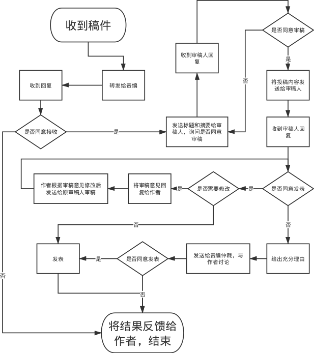

# Main Website
## 业务逻辑与功能介绍

### 投稿系统

投稿系统是本站最为核心的功能，系统处理流程图如下所示。



用户使用注册帐号时的邮箱发邮件给投稿邮箱，系统会先转发邮件给责任编辑，责任编辑初审后回复邮件给投稿邮箱，同意接收则系统会再发邮件给关注了相关关键字的审稿人询问是否愿意审稿，此时仅包含题目和摘要。如果审稿人同意审稿则回复邮件，系统会再发送稿件包含的所有内容到审稿人邮箱。审稿人最长有三天时间进行审稿，审稿完成后发送审核意见给系统邮箱。系统邮箱接到审稿意见后，若审稿意见全是同意，则直接发表；如果有审稿意见，则将审稿意见反馈给投稿用户，投稿用户修改后再次投稿。如果有审核意见为不同意发表，则只有在投稿文章的核心观点本身就是错误的情况下审稿人才能不同意发表，此时审稿人必须提交完整且清晰的论证说明给责任编辑，然后由责任编辑将审核意见反馈给投稿用户，用户在阅读完审稿人的审稿意见后，认为文章核心观点没有问题，审稿意见有误，可以申请责任编辑进行仲裁；如果认为文章核心观点有误，则可以放弃此次投稿，进行进一步研究后再另投新稿。

### 首页

登录后可显示符合兴趣关键字的文章。

最新接收稿件排序列表。

最高阅读量稿件排序列表。

最低阅读量稿件排序列表。

### 用户注册

在网页上注册。

### 用户登录

在网页上登录。

### 申请成为审稿人

在网页上提交申请，选择自己有能力审稿的领域的关键字。

### 用户个人信息管理

在网页上进行修改，需登录使用。

### 用户信息查看

显示用户信息。 

### 订阅

提供邮箱，选择自己感兴趣的关键字，选择邮件发送频率便可。

### 信誉值

用户信誉值初始为100，且最高为100，如果用户有违规行为，会降低信誉值，不同违规行为扣除的分值不同。投稿或审稿会增加信誉值。当信誉值低于80时，用户会被禁言并禁止投稿，需要提交说明文件对自己的违规行为做出解释，通过审核后，信誉值会被设置为80，这时可以通过投稿或审稿来提高自己的信誉值。

### 影响力

用户影响力初始为0，上不封顶，通过文章阅读量计算得到。

## 技术选型

操作系统：CentOS-7.6

数据库：PostgreSQL-10

Python解释器：Python-3.6.7

框架：Django-2.2.1

服务器：nginx-1.16

## 调研项目

### 项目

- 是否使用Django自带的应用admin和auth
- 是使用Django自带的ORM模型，还是使用SQLAlchemy
- Django的安全防御机制可以使用哪些

### 调研结果

- 使用Django自带的应用admin和auth，因为自定义的数据库模型可以被添加到管理界面 [1]，而且用户表可以被自定义扩展 [2]，能够免去很多工作。
- 使用Django自带的ORM模型，不使用SQLAlchemy，因为Django自带的ORM模型可以满足本项目的需要 [3]，并且可以和auth和admin无缝契合。

## 开发环境搭建

### 安装与配置PostgreSQL-10

安装PostgreSQL。Ubuntu官源默认包含PostgreSQL，可以直接用`sudo apt-get install postgresql-10`来安装 [4]。

创建数据库。PostgreSQL在安装好后会在系统中创建一个名为postgres的用户，并且在数据库中创建一个同名的超级用户，在自行创建更多的用户前我们只能通过这个默认用户来连接数据库 [5]，我们使用`sudo -i -u postgres`命令来切换到postgres用户，然后通过命令`createdb website`创建数据库。

创建操作系统同名用户并授予其website数据库的所有权限，以便使用Peer Authentication [6]。切换到postgres用户后，使用命令`createuser 用户名 --interactive`来交互式地创建用户，创建过程会提三个问题，问该用户是否是超级用户、能否创建数据库、能否创建用户，按照具体需要选择便可。创建好后打开PostgreSQL的交互式终端psql [7]，使用`\c website`切换到创建好的数据库，然后使用以下SQL语句进行授权与更改用户密码。如果只使用Peer Authentication，则不需要设置密码。

```plsql
grant all on database website to 用户名;
grant all privileges on all tables in schema public to 用户名;
alter user 用户名 with password '密码'
```

### 安装Django-2.2.1并创建项目

安装Django。`sudo pip3 install Django==2.2.1`。

创建Django项目。`django-admin startproject site_name`。

**注意安装与使用了哪些中间件**。

设置数据库，在`settings.py`文件中，

```python
DATABASES = {
    'default': {
        'ENGINE': 'django.db.backends.postgresql',
        'NAME': 'website',  # 数据库名
        'USER': 'user_name',  # 运行服务器的操作系统用户名
        'PASSWORD': '',  # Peer Authentication不需要密码
        'HOST': '',  # 不置空会导致密码验证失败
        'PORT': '',  # 置空使用默认的5432端口
    }
}
```

为Django当中安装的应用迁移数据库，运行`python3 manage.py migrate`即可。

## 测试环境搭建

### 安装VirtualBox

到[下载页面](https://www.virtualbox.org/wiki/Downloads)根据自己的系统版本选择相应的安装包，下载并安装。安装过程无需特殊设置，一律选择默认选项。

### 创建虚拟机

虚拟机类型：Linux，Red Hat(64-bit)

CPU：1核

内存：1G

硬盘：固定大小，40G

### 主机访问虚拟机

此举一是便于测试，二是便于通过SSH连接后粘贴命令。根据[8]中的内容与表6.1可以看出，实现该目标最为简单且有效的设置是使用Bridged Adapter。在Oracle VM VirtualBox Manager窗口中，设置Settings->Network->Attached to [Bridged Adapter]便可通过主机访问虚拟机。

### 在虚拟机中安装CentOS-7.6

下载[Minimal ISO](http://mirrors.tuna.tsinghua.edu.cn/centos/7.6.1810/isos/x86_64/CentOS-7-x86_64-Minimal-1810.iso)进行安装。以下是安装选项的配置信息。除此处列明的配置信息外，其他选项一律采用默认设置。

| 选项                     | 内容                                  |
| ------------------------ | ------------------------------------- |
| Language                 | English (United States)               |
| Date & Time              | Asia/Shanghai timezone                |
| Software Selection       | Minimal Install                       |
| Installation Destination | Automatically configure partitioning. |
| Security Policy          | No profile selected                   |
| Root Password            | 123                                   |

### 自动化搭建脚本

如果不是对搭建步骤完全熟悉的话，尽量选择手动安装方式，以免自动安装脚本因为某些例外情况报错后不会查错。

```bash
#!/bin/bash

yum install -y net-tools wget gcc zlib-devel openssl-devel yum-utils

echo -e "[nginx-stable]\nname=nginx stable repo\nbaseurl=http://nginx.org/packages/centos/\$releasever/\$basearch/\ngpgcheck=1\nenabled=1\ngpgkey=https://nginx.org/keys/nginx_signing.key\n\n[nginx-mainline]\nname=nginx mainline repo\nbaseurl=http://nginx.org/packages/mainline/centos/\$releasever/\$basearch/\ngpgcheck=1\nenabled=0\ngpgkey=https://nginx.org/keys/nginx_signing.key" > /etc/yum.repos.d/nginx.repo

yum-config-manager --enable nginx-stable

yum install -y https://download.postgresql.org/pub/repos/yum/reporpms/EL-7-x86_64/pgdg-redhat-repo-latest.noarch.rpm

yum install -y nginx postgresql10 postgresql10-server

/usr/pgsql-10/bin/postgresql-10-setup initdb

systemctl enable nginx
systemctl start nginx
systemctl enable postgresql-10
systemctl start postgresql-10

firewall-cmd --permanent --add-port=80/tcp
firewall-cmd --reload

wget https://www.python.org/ftp/python/3.6.7/Python-3.6.7.tar.xz
tar -xvf Python-3.6.7.tar.xz
cd Python-3.6.7
./configure --enable-optimizations
make
make install

pip3 install -r requirements.txt
```

requirements.txt

```
Django==2.2.1
```

### 手动安装步骤

#### 安装必备小工具

```
yum install -y net-tools wget ssh-server vim gcc zlib-devel openssl-devel
```

#### 安装nginx-1.16

依照[9]中的指示安装便可，这里我们安装nginx-stable中的1.16版本，安装好后通过以下命令设置开机启动并启动nginx，以及将在防火墙中设置开放80端口。启动后通过本机访问测试平台IP，端口80，如果看到nginx的欢迎页面，说明安装成功。

```shell
systemctl enable nginx  # 开机自启
systemctl start nginx  # 启动
firewall-cmd --permanent --add-port=80/tcp  # 永久开放80端口
firewall-cmd --reload  # 重新加载防火墙配置以生效
```

#### 安装PostgreSQL-10

CentOS7官源中的PostgreSQL的最高版本为9.2版，因此需要添加源来安装10版本的PostgreSQL [10]。在[10]中PostgreSQL Yum Repository章节里选择相应版本便可得到安装引导。

```
yum install https://download.postgresql.org/pub/repos/yum/reporpms/EL-7-x86_64/pgdg-redhat-repo-latest.noarch.rpm

yum install postgresql10
yum install postgresql10-server

/usr/pgsql-10/bin/postgresql-10-setup initdb

systemctl enable postgresql-10
systemctl start postgresql-10
```

安装后根据搭建开发环境时的步骤更改用户密码。

#### 安装Python-3.6.7

CentOS7默认安装的Python版本为2.7.5，想要安装3.6版本的我们就需要通过编译来安装。下载[源码包](https://www.python.org/ftp/python/3.6.7/Python-3.6.7.tar.xz)后，执行以下操作。编译过程需要的相关依赖已经在“安装必备小工具”里全部安装过了。

```
tar -xvf Python-3.6.7.tar.xz
cd Python-3.6.7
./configure --enable-optimizations
make
make install
```

#### 安装Python依赖环境

```
pip3 install Django==2.2.1
```

### 安装后的配置

根据“开发环境搭建”中“安装与配置PostgreSQL-10”提到的步骤创建数据库、创建操作系统同名用户、授权、更改密码。

## 数据库设计

### 数据库表

| 表名            | 说明                                                |
| --------------- | --------------------------------------------------- |
| auth_user       | 用户表（存储用户基本信息，Django自动生成）          |
| keyword         | 关键字表（用户关注的关键字）                        |
| user_keyword    | 用户-关键字关系表（用户与关键字之间是多对多的关系） |
| article         | 文章表（存储文章信息）                              |
| content         | 文章内容表（存储文章不同版本的内容）                |
| article_keyword | 文章-关键字关系表（文章与关键字之间是多对多的关系） |
| user_article    | 用户-文章关系表（用户与文章之间是多对多的关系）     |
| comment         | 文章评论表（存储对文章的评论）                      |

### 用户表（user_account）

| 列名        | 说明               | 数据类型 | 约束条件      |
| ----------- | ------------------ | -------- | ------------- |
|             | Django自动生成的列 |          |               |
| credit      | 信誉积分           | int      | default=100   |
| influ       | 影响力             | float    | default=0.0   |
| is_reviewer | 是否为审稿人       | boolean  | default=False |

### 关键字表（keyword）

| 列名 | 说明           | 数据类型    | 约束条件          |
| ---- | -------------- | ----------- | ----------------- |
| id   | 关键字唯一标识 | int         | primary key       |
| name | 关键字名       | varchar(30) | not null & unique |

### 用户关键字关系表（user_keyword）

| 列名       | 说明                   | 数据类型 | 约束条件      |
| ---------- | ---------------------- | -------- | ------------- |
| user_id    | 用户ID                 | int      | foreign key   |
| keyword_id | 关键字ID               | int      | foreign key   |
| is_review  | 是否为愿意审稿的关键字 | boolean  | default=False |

### 文章表（article）

| 列名    | 说明         | 数据类型     | 约束条件                     |
| ------- | ------------ | ------------ | ---------------------------- |
| id      | 文章唯一标识 | int          | primary key & auto increment |
| title   | 标题         | varchar(255) | not null                     |
| reads   | 阅读量       | int          | default=0                    |
| pubtime | 发表时间     | timestamp    | default=now()                |

### 文章内容表（content）

| 列名       | 说明             | 数据类型  | 约束条件                     |
| ---------- | ---------------- | --------- | ---------------------------- |
| id         | 文章内容唯一标识 | int       | primary key & auto increment |
| content    | 内容             | text      | not null                     |
| modif      | 修改说明         | text      |                              |
| sbmt_time  | 提交时间         | timestamp | default=now()                |
| article_id | 文章ID           | int       | foreign key                  |

### 文章评论表（comment）

| 列名       | 说明         | 数据类型  | 约束条件                     |
| ---------- | ------------ | --------- | ---------------------------- |
| id         | 评论唯一标识 | int       | primary key & auto increment |
| content    | 内容         | text      | not null                     |
| pubtime    | 发表时间     | timestamp | default=now()                |
| user_id    | 用户ID       | int       | foreign key                  |
| content_id | 文章内容ID   | int       | foreign key                  |

## 服务器响应API设计

| API                 | 功能                 | 参数     |
| ------------------- | -------------------- | -------- |
| get_newest_article  | 获取最新文章         | num 数量 |
| get_viewest_article | 获取阅读量最高的文章 | num 数量 |
| get_fewest_article  | 获取阅读量最少的文章 | num 数量 |

## 开发步骤

### 拓展Django内置用户模型

### 实现数据库模型

## 参考文献

[1] Django Community. 编写你的第一个Django应用，第2部分. Django文档. [Official Webpage](https://docs.djangoproject.com/zh-hans/2.1/intro/tutorial02/#make-the-poll-app-modifiable-in-the-admin).

[2] Django Community. Django中的自定义验证. Django文档. [Official Webpage](https://docs.djangoproject.com/zh-hans/2.1/topics/auth/customizing/#extending-the-existing-user-model).

[3] Django Community. Model field reference. Django文档. [Official Webpage](https://docs.djangoproject.com/zh-hans/2.2/ref/models/fields/#datefield).

[4] The PostgreSQL Global Development Group. PostgreSQL: Linux downloads (Ubuntu). [Official Webpage](https://www.postgresql.org/download/linux/ubuntu/).

[5] The PostgreSQL Global Development Group. PostgreSQL: Documentation: 10: 21.1. Database Roles. [Official Webpage](https://www.postgresql.org/docs/10/database-roles.html).

[6] The PostgreSQL Global Development Group. PostgreSQL: Documentation: 10: 20.3. Authentication Methods. [Official Webpage](https://www.postgresql.org/docs/10/auth-methods.html)

[7] The PostgreSQL Global Development Group. PostgreSQL: Documentation: 10: psql. [Official Webpage](https://www.postgresql.org/docs/10/app-psql.html).

[8] Oracle Corporation. Chapter 6. Virtual Networking. Oracle® VM VirtualBox® User Manual. [Official Webpage](https://www.virtualbox.org/manual/ch06.html).

[9] Nginx, Inc. nginx: Linux packages. [Official Webpage](http://nginx.org/en/linux_packages.html#RHEL-CentOS).

[10] The PostgreSQL Global Development Group. PostgreSQL: Linux downloads (Red Hat family). [Official Webpage](https://www.postgresql.org/download/linux/redhat/).